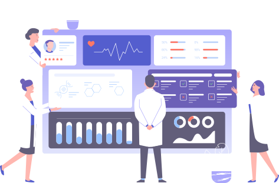
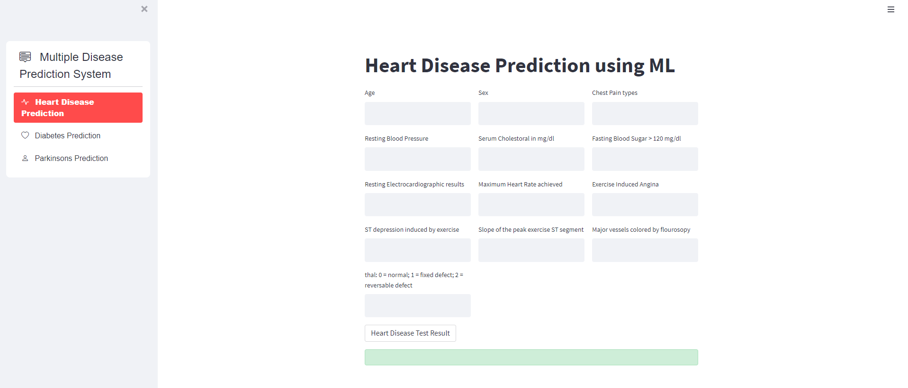
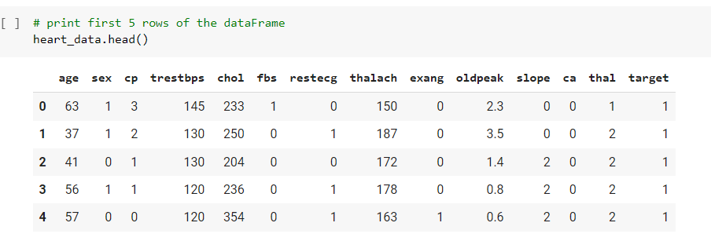
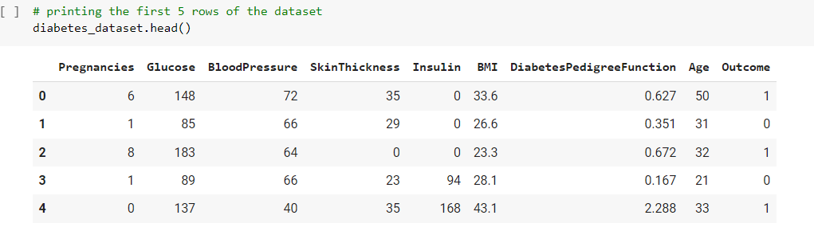
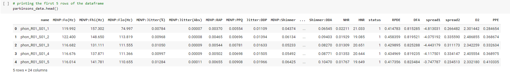
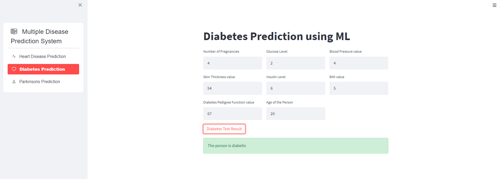

<h1 align="center">
   
  
   
Multiple Chronic Disease Prediction

   
</h1>

<h4 align="center"> Streamlit web app on heroku</h4>

  
  
  
  
  
  <!---->

  <a href="#Objective">Objective</a> •
  <a href="#Dataset">Dataset</a> •
  <a href="#credits">Credits</a> •
  <a href="#support">Support</a>

 
  

## Objective

Deployed Streamlit web app on Heroku, to predicti disease using Machine Learning

 

## Dataset

The used datasets are available on Kaggle.
 

 
  

 
  

 
  

## Results

 
  

## Credits

- Emojis are taken from [here](https://github.com/arvida/emoji-cheat-sheet.com)

- [Siddhardhan](https://www.youtube.com/@Siddhardhan) youtube channel.

## Support

## You may also like...

- [License Plate Recognition](https://github.com/wassima-manssour/YOLOV7-License-Plate-Recognition) - A License Plate recognition system using YOLO v7, OCR, and theos API.
- [Multiple Chronic Disease Prediction](https://github.com/wassima-manssour/multidiseasepredictionML) - A streamlit web app hosted on Heroku to predicti disease using Machine Learning.

---

> GitHub [@wassima-manssour](https://github.com/wassima-manssour) &nbsp;&middot;&nbsp;
> Linkedin [@wassima-manssour](https://www.linkedin.com/in/wassima-manssour-b48a7018a/)

